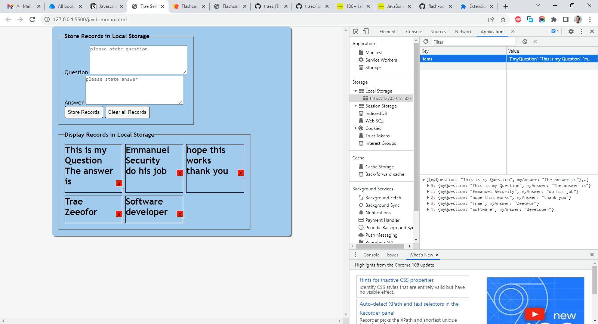

# jsbeginners.com - FlashCard OOP Project solution

This is a solution to the [FlashCard OOP JavaScript Project on JS Beginners](https://jsbeginners.com/flashcard-javascript-oop-project/). I am trying to improve my coding skills by building realistic projects. 

## Table of contents

- [Overview](#overview)
  - [The challenge](#the-challenge)
  - [Screenshot](#screenshot)
  - [Links](#links)
- [My process](#my-process)
  - [Built with](#built-with)
  - [What I learned](#what-i-learned)
  - [Continued development](#continued-development)
  - [Useful resources](#useful-resources)
- [Author](#author)
- [Acknowledgments](#acknowledgments)

## Overview

### The challenge

- The objective of this JavaScript course form project is use JavaScript OOP to create a flash card web application. Users should be able to add and delete flashcards. As well as clear whole flashcards in one go.  

### Screenshot

### Links

- Solution URL: [https://github.com/traez/flashcard-local-storage-oop-project](https://github.com/traez/flashcard-local-storage-oop-project)
- Live Site URL: [https://traez.github.io/flashcard-local-storage-oop-project/](https://traez.github.io/flashcard-local-storage-oop-project/)

## My process

### Built with

- Semantic HTML5 markup
- CSS custom properties
- Flexbox
- CSS Grid
- JavaScript

### What I learned

More practical and comfortable use of local storage and object orientation.  

### Continued development

Need to explore constructor functions and prototypes on the next project. JavaScript was the focus for this project, so did only the barest minimum CSS.   

### Useful resources

Stackoverflow, MDN Web Docs, w3schools, YouTube, Google 

## Author

- Website - [Trae Zeeofor](https://github.com/traez)  
- Twitter - [@trae_z](https://twitter.com/trae_z) 

## Acknowledgments

Stay Obidient, stay useful to yourself. Thanks Gee [https://github.com/iamcodefoxx/Flashcards](https://github.com/iamcodefoxx/Flashcards)   
